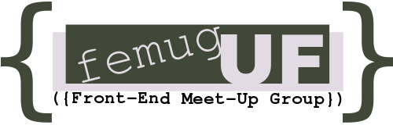
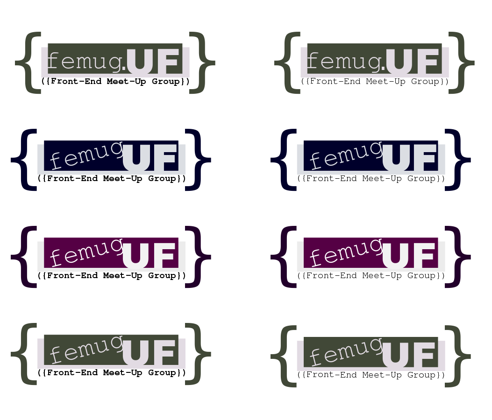

## Esclarecimentos

Fiz um logo principal e algumas versões alternativas para apreciação. Uma das opções brinca com a ideia de um objeto JS representando o FEMUG e tendo como atributo a UF em questão.(femug.UF). As demais são variações da ideia principal, porém com cores diferentes, como se pode ver nas imagens abaixo.

#Opção principal:

#Alternativas à opção principal:

Este é o primeiro projeto open em que contribuo. Mesmo não sendo aceito, já vale pela adrenalina heheheheheh.
