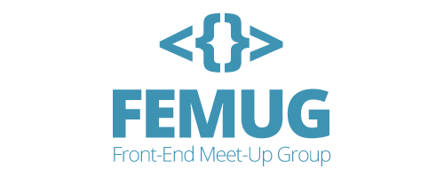
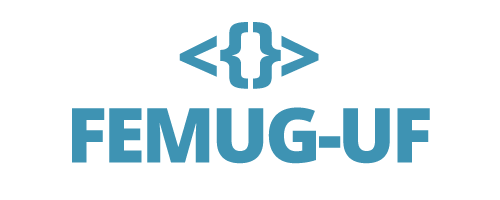
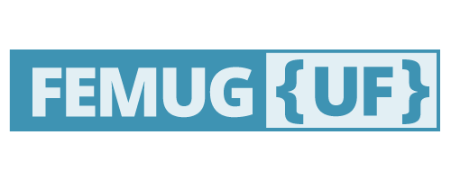

## Defesa da criação

Logo 1:

A logo foi criada pensando na simplicidade e aplicações de identidade, para o ícone foi utilizada um elemento que representa a linguagem de marcação "< >" e um elemento que representa a linguagem interpretada/manipulação "{ }".

Para trabalhar com as UF's podem tem duas opções sugerida:

ou

Logo 2:

Utilizando o mesmo conceito porem unificada.

## Homologação

Este documento será alterado após a logo ser escolhida, aqui deve conter o manual da logo, como paleta de cores, margem de aplicação, etc.

Após a escolha será disponibilidado o .svg!
